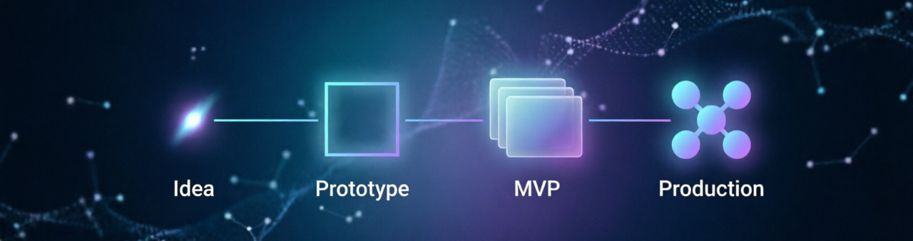

# Привет, я Ирина 👋

  

Занимаюсь **vibe coding**: описываю задачу на человеческом языке — нейросеть генерирует код, я собираю и довожу продукт. Учусь строить AI-инструменты и запускать их от идеи до опубликованного MVP.

## О проекте, который сейчас в фокусе

📌 **[КП-калькулятор](https://github.com/irin-dev/kp-calculator-v2)** — веб-инструмент для быстрого расчёта коммерческого предложения на разработку чат-бота: короткая воронка из 7–9 вопросов → вилка стоимости → готовое КП в HTML/PDF.

- Python (стандартная библиотека, без внешних зависимостей)
- Сервер считает цены — фронтенд не дублирует формулу
- 28 юнит-тестов
- Это моя выпускная работа: от идеи до опубликованного MVP + скилл для агента

## Что умею

- **Vibe coding:** формулирую задачу и архитектуру → даю нейросети (Claude Code / OpenCode) → собираю, тестирую и довожу результат
- **Python:** веб-серверы, тесты (pytest), JSON-конфигурация
- **Frontend:** Vanilla JS, HTML, CSS (адаптивная вёрстка)
- **AI-инструменты:** агенты для разработки, локальные LLM (Ollama), промпты под конкретные задачи
- **Git / GitHub:** репозитории, публикация проектов, переносные скиллы для агентов

## Мои проекты

- [КП-калькулятор](https://github.com/irin-dev/kp-calculator-v2) — вилка стоимости бота + генерация КП (активный, выпускной)
- *(здесь будут учебные проекты — добавляю по мере публикации)*

## Контакты

- Email: t36978575@gmail.com
- Telegram: [@irin_dev](https://t.me/irin_dev)
- GitHub: [irin-dev](https://github.com/irin-dev)

---
*Профиль — часть выпускного проекта по vibe coding. Спасибо, что заглянули!*